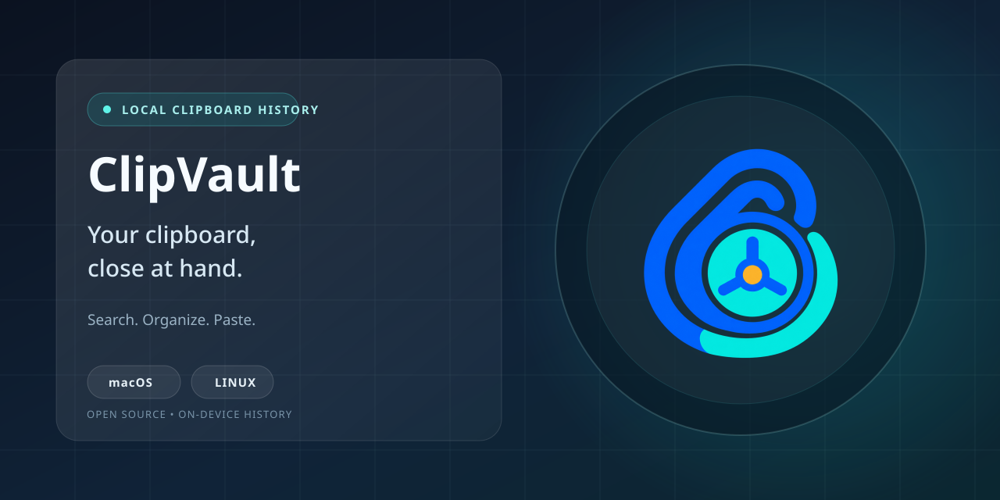
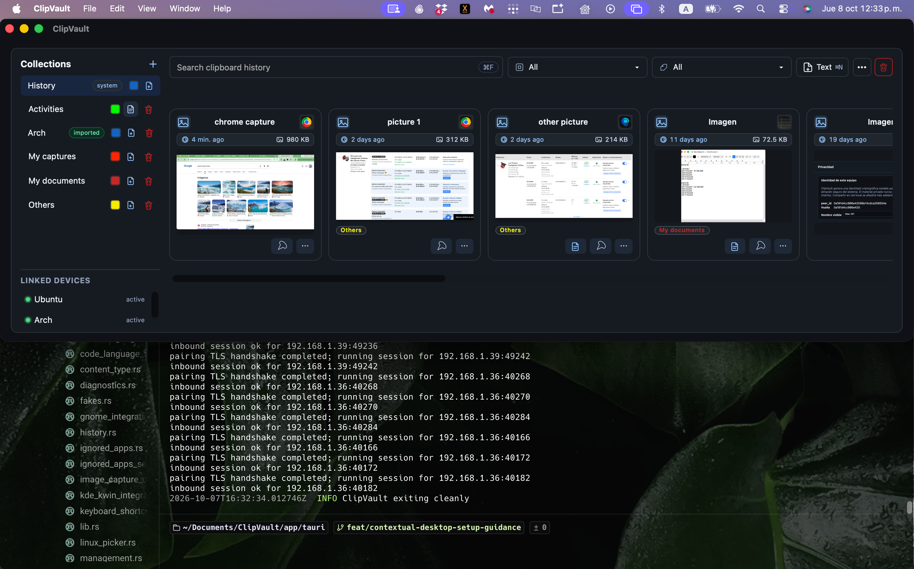
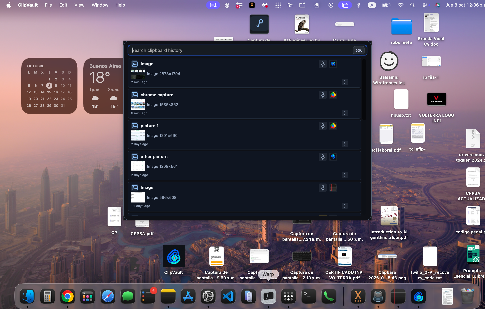
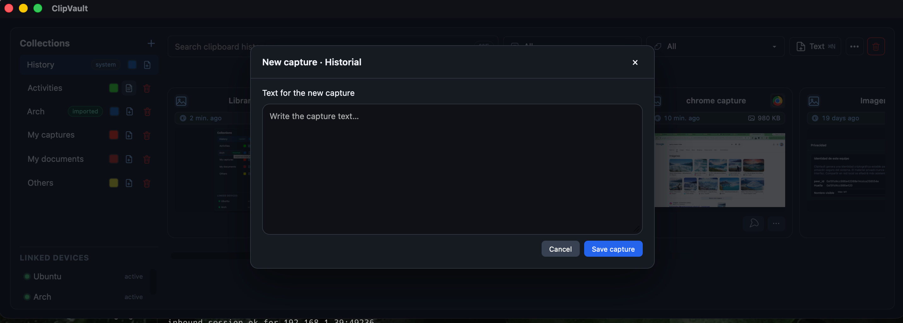
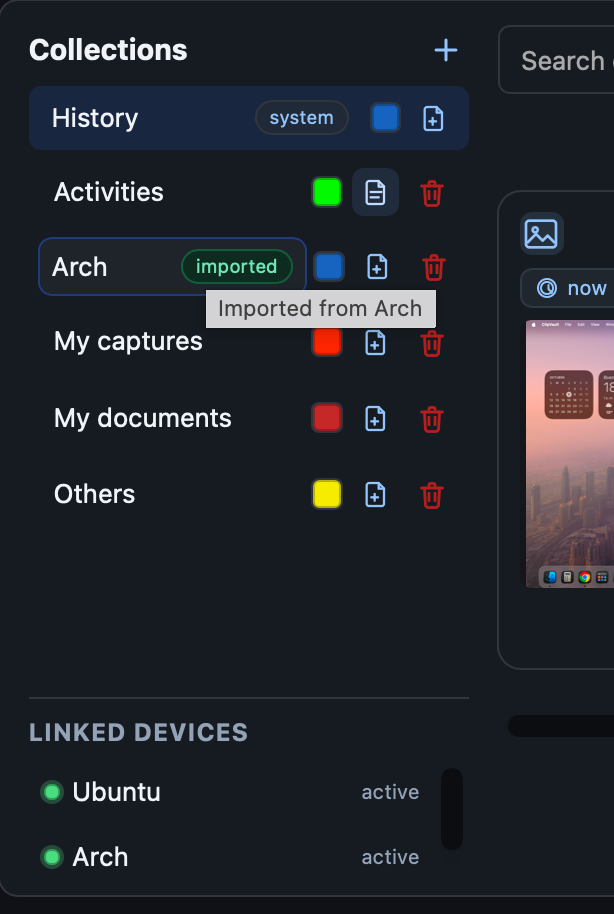

# ClipVault

**Historial local del portapapeles para macOS y Linux.** Busca, organiza y
reutiliza elementos copiados con una aplicación de escritorio pensada para el
teclado.

[English](README.md) · [Español](README.es.md) ·
[Descargar la última versión](https://github.com/dgadduci/clipvault/releases/latest) ·
[Guías de instalación](docs/install/README.md)

ClipVault conserva localmente el historial del portapapeles: texto, texto con
formato e imágenes. También permite crear capturas de texto manualmente. Usa
la ventana completa para editar y organizar capturas, o abre Quick Paste para
encontrar un elemento reciente desde una vista compacta y pensada para el
teclado. También puedes vincular equipos ClipVault de la misma red local para
consultar e importar capturas seleccionadas.

## Funciones

- Captura automáticamente texto, texto con formato e imágenes del
  portapapeles; muestra la aplicación de origen cuando está disponible.
- Crea capturas de texto directamente en ClipVault, edita su contenido y sus
  títulos, y añade notas para conservar el contexto.
- Busca en el historial local y filtra por colección, etiqueta, tipo de
  contenido o aplicación de origen.
- Organiza capturas en colecciones, asígnales etiquetas, márcalas como
  favoritas y fija las más importantes.
- **Quick Paste:** abre su ventana compacta con un atajo de teclado; busca una
  captura reciente y cópiala para pegarla en la aplicación donde estabas
  trabajando, sin abrir la ventana completa del historial.
- **Compartición en red local:** activa la función y vincula equipos ClipVault
  de la misma red para consultar las capturas recientes de texto e imágenes de
  un equipo de confianza. Importa solo las que elijas; quedan guardadas en tu
  historial local y no hay sincronización automática.
- Pausa la captura, excluye aplicaciones determinadas y elige cuánto tiempo
  conservar el historial.
- Configura atajos de teclado para abrir la ventana principal y Quick Paste.

## Capturas

Más vistas de ClipVault

## Descargas y plataformas

Los releases oficiales ofrecen imágenes de disco para macOS Apple silicon e
Intel, además de paquetes DEB y AppImage para Linux x86_64. La guía de
instalación indica qué combinaciones de escritorio y sesión están comprobadas
y cuáles siguen pendientes; una prueba en una sesión Linux no confirma el
comportamiento de otra.

- [Descargar la última versión](https://github.com/dgadduci/clipvault/releases/latest)
- [Elegir un instalador y consultar los primeros pasos](docs/install/README.md)
- [Ver detalles de releases y actualizaciones](docs/releases.md)

## Privacidad

El historial del portapapeles se guarda localmente; el uso normal no requiere
una cuenta en la nube. Para buscar actualizaciones, ClipVault se conecta a
GitHub mediante HTTPS e informa la versión de la aplicación, el sistema
operativo y la arquitectura del procesador. No envía el contenido del
portapapeles. Consulta las [notas de releases y del actualizador](docs/releases.md)
para más detalles.

## Ayuda y contribuciones

- [Soporte y reportes de problemas](SUPPORT.md)
- [Cómo contribuir](CONTRIBUTING.md)
- [Guía para reportar problemas de seguridad](SECURITY.md)
- [Licencia GNU GPL versión 3](LICENSE)

ClipVault está desarrollado con Rust, Tauri y Svelte. Consulta la
[guía de desarrollo](docs/development.md) para conocer las herramientas y
verificaciones de quienes contribuyen.
